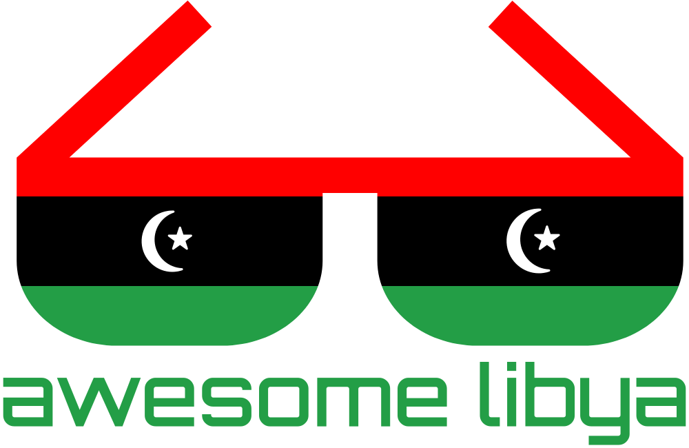

  
  

  

    <b>👩‍💻 🇱🇾 List of awesome Libyan things for developers 🇱🇾 👨🏻‍💻</b>
     
  

  

---

## 🧠 Contents

- [Communities](#-communities)
- [Tech Events & Meetups](#-tech-events--meetups)
- [Libyan Dev Blogs & Portfolios](#-libyan-dev-blogs--portfolios-)
- [Podcasts & YouTube Channels](#-podcasts--youtube-channels)
- [Learning Platforms & Education Centers](#-learning-platforms--education-centers)
- [Books](#-books)
- [Open Source Projects](#-open-source-projects)
    - [JavaScript](#-javascript)
    - [C#](#-csharp)
    - [PHP](#-php)
    - [Flutter](#-flutter)
    - [CSS](#-css)
    - [Others](#-others)
- [Developer Resources](#-developer-resources)
- [Companies & Startups](#-companies--startups)
- [Government & Public APIs](#-government--public-apis)
- [Contributing](#-contributing)

---

## 🤝 Communities

- [WeCode Libya](https://www.facebook.com/groups/wecode.ly)
- [رابطة مبرمجي ليبيا 💻🇱🇾](https://www.facebook.com/groups/LY.Programmers/)
- [WordPress in Libya](https://www.facebook.com/groups/wplibya)

 [(Back to top)](#-contents)

---

## 🎉 Tech Events & Meetups

| Event                                  | DateTime       |
| -------------------------------------- | -------------- | 
| [Devfest Tripoli 2025](https://gdg.community.dev/events/details/google-gdg-tripoli-presents-devfest-tripoli-2025) | 2025 Nov 22, 03:00 – 09:00 PM (GMT+2) |
| [National Technology Day (اليوم الوطني لتقنية المعلومات)](https://ntd.ly) | 2026 Jun 01, 11:00-05:00 PM (GMT+2) |
| [Developers summit - قمة المطورين ](https://www.facebook.com/Developers.Summit) | 2026 Jun 01, 11:00-05:00 PM (GMT+2) |

 [(Back to top)](#-contents)

---

## 👨🏾‍💻 Libyan Dev Blogs & Portfolios 👩🏻‍💻

| Name                | Blog                      | Focus                |
| ------------------- | ------------------------- | -------------------- |
| [Abdalraheem Dehom](https://www.facebook.com/raheem.dehom) | Programming fundamentals | Teaching Students |
| [Zakaria Sassi ](https://www.facebook.com/zakariasassi.1096) | Programming Courses | Software Engineering |
| [Feras Ariabi](https://ferasariabi.vercel.app/) | Programming Courses | Web Development |
| [Abdulmottaleb Elabour](https://www.youtube.com/@drvb1983) | Programming Cources | .NET |
| [Firas Al Dweni](https://www.facebook.com/firasaldweni) | Tech | ReactJS, WordPress |
| [Lazord El-Fizga](https://www.linkedin.com/in/lazord-el-fizga-91a517171/) | UI/UX Courses | UI/UX |

 [(Back to top)](#-contents)

---

## 🎧 Podcasts & YouTube Channels

Nothing Here yet!
Help us to make this page great ( [ClickHere](CONTRIBUTING.md) )

 [(Back to top)](#-contents)

---

## 📖 Learning Platforms & Education Centers

- [Flutter Crash Cource](https://flutter-courser1.vercel.app)
- [Orange Academy](https://www.facebook.com/profile.php?id=61554457328986)

 [(Back to top)](#-contents)

---

## 📚 Books

Nothing Here yet!
Help us to make this page great ( [ClickHere](CONTRIBUTING.md) )

 [(Back to top)](#-contents)

---

## 💻 Open Source Projects

Others

| Project                                           | Description                                           | Tech Stack       |
| ------------------------------------------------- | ----------------------------------------------------- | ---------------- |
| [awesome-libya](https://github.com/awesome-libya) | This list itself                                      | Markdown |

 [(Back to top)](#-contents)

---

## 📘 Developer Resources

- 🇱🇾 **Libyan ISPs**: [LTT](https://ltt.ly) | [Almadar](https://www.almadar.ly/) | [Giga](https://giga.ly) | [Ozon Aljadeed](http://ozon.ly) | [SparkTech](https://sparktech.ly) | [SkyNET](https://skynet.net.ly/)
- 🗺 **Libya Maps & GIS**: [OpenStreetMap Libya](https://www.openstreetmap.org/#map=6/27.5/17)
- 💰 **Finance APIs**: [Central Bank (CBL)](https://central-bank-of-libya.gitbook.io/devportal) | [Plutu](https://plutu.ly/) | [T-Lync](https://tdsp.ly/)
- 🗃 **Libya Datasets**: [World Bank Data](https://data.worldbank.org/country/libya)
- 🤖 **Artificial Intelgence**: [HuggingFace Datasets](https://huggingface.co/datasets?search=libya)
- ✉️ **SMS & OTP**: [Resala](https://resala.ly/) | [LibyaSMS](http://libyasms.com/) | [Rasael](https://www.rasael.ly/)
- ☁️ **Hosting**: [LibyanSpider](https://libyanspider.com)
- ⚙️ **Demo APIs**: [Public APIs](https://github.com/public-apis/public-apis)

 
 [(Back to top)](#-contents)

---

## 🏢 Companies & Startups

- [LibyanSpider](https://libyanspider.com)
- [Sadeem IoT](https://sadeem-tech.com)
- [EasySoft](https://www.easysoft.ly/)

 [(Back to top)](#-contents)

---

## 🧩 Government & Public APIs

Nothing Here yet!
Help us to make this page great ( [ClickHere](CONTRIBUTING.md) )

 [(Back to top)](#-contents)

---

## 🤝 Contributing

We welcome contributions from everyone!  
See [CONTRIBUTING.md](CONTRIBUTING.md) before submitting a PR.

 [(Back to top)](#-contents)

---

## 🧭 License

[CC BY 4.0](LICENSE)

 [(Back to top)](#-contents)
